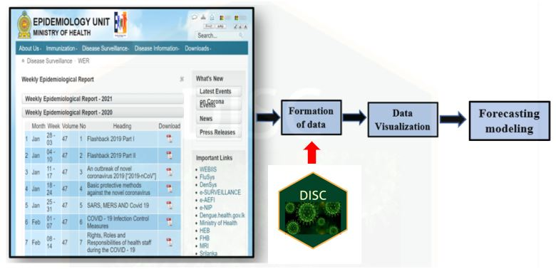
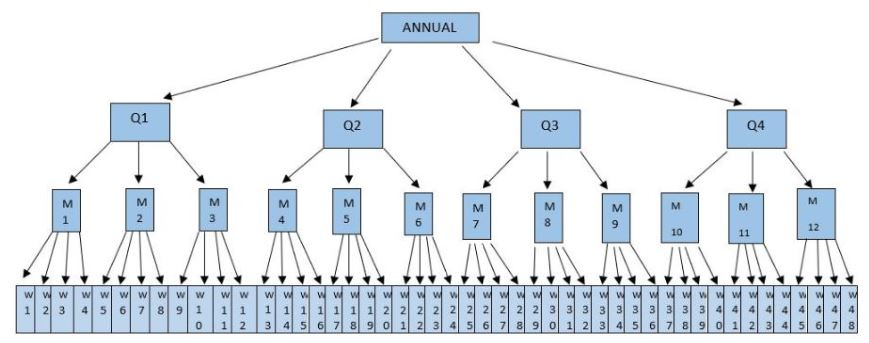

class: inverse, middle, center

.Intrdc[Introduction]

<style>
.Intrdc{
font-size: 4em;
font-weight: bold;
}
</style>

---

```{r, code=readLines("plt.R"),echo=FALSE,results='hide',message=FALSE,warning=FALSE}
```

# Twin Threats: The Dangers of Dengue in a COVID-19 World

```{r figurechapter01, echo=FALSE, message=FALSE, out.width = '90%', out.height = '60%',fig.height=5, fig.width=10, fig.align = 'center'}

CVsD+ transition_reveal(Date)

```

---

```{r figurechapter02, echo=FALSE, fig.align = 'center',message=FALSE, out.width = '80%', out.height = '50%',fig.height=3, fig.width=10}

```

* Overall health system cost of dengue response in Colombo district in 2012 amounted to 452.9 million Sri Lankan Rupees.


```{r figurechapter0002, echo=FALSE, fig.align = 'center',message=FALSE, out.width = '30%', out.height = '20%',fig.height=2, fig.width=6}

```

source (page 25) : https://www.epid.gov.lk/web/images/pdf/Publication/Health_System_Cost_for_Dengue.pdf

---

class: inverse, middle, center

.LIT[Literature Review]

<style>
.LIT{
font-size: 4em;
font-weight: bold;
}
</style>

---

```{r figurechapter0333, echo=FALSE, fig.align = 'center',message=FALSE, out.width = '100%', out.height = '80%',fig.height=8}

```

---

# Linear Models 

#### ARIMA models

* Modeling dengue incidence in .pinkA[four regions of Philippines] between 2008 and 2015 (Pineda-Cortel et al. 2019).

* Forecast dengue in .pinkA[Subang Jaya, Malaysiya] based on 2005 to 2010 data (Domet al. 2013).

* Forecast dengue hemorrhagic fever in .pinkA[Asahan district] for monthly data from 2012 to 2016 (Siregar, Makmur & Saprin 2018).

#### ARIMA and exponential smoothing models

* Predict dengue incidence in .pinkA[Colombo district of Sri Lanka] from January of 2010 to November of 2017 monthly data (Attanayake, Perera & Liyanage 2019).

* Prediction of dengue incidence in .pinkA[North India] based on monthly data from 2014 to 2017 (Shashvat, Basu & Bhondekar 2019).

#### Poisson autoregressive model

* Model dengue incidence for the period of 1996 to 2005 in .pinkA[two geographically diverse regions of Thailand] (Tipayamongkholgul et al. 2009).

<style>
.pinkA{
color: #dd1c77;
font-weight: bold;
font-size: 1em;
}
---

# Non-linear Models

#### Neural network models

* Predict the dengue counts in .pinkA[Philippine Visayas Island group] for the period of 2010 to 2015 ( Datoc, Caparas & Caro 2016).

* Modeling dengue based on weekly data from January 2001 to April 2007 in .pinkA[Singapore] (Aburas, Cetiner & Sari 2010).

#### Hybrid modeling approach

* Chakraborty, Chattopadhyay & Ghosh (2019) proposed combination of ARIMA model and neural network autoregressive (NNAR) model to predict dengue incidence in  in .pinkA[three dengue endemic regions], namely San Juan, Iquitos, and the Philippines.

#### Neural network model (NNM) and non linear regression model

* Dengue Outbreak Prediction in .pinkA[Malaysia] based on weekly data between 2004 and 2005 (Husin, Salim & others 2008).

<style>
.pinkA{
color: #dd1c77;
font-weight: bold;
font-size: 1em;
}
---

# Pattern Identification

#### Cluster analysis

* Dengue transmission pattern identification in .pinkA[New Delhi of India] based on the data of 2006 to 2015 (Agarwal et al. 2018).

#### Wavelet analysis

* Identify the periodicity  and districts with similar pattern of dengue dynamics in .pinkA[25 districts of Sri Lanka] from January 2009 to September 2014 (Talagala & Lokupitiya 2015). 

* Identify the periodicity in .pinkA[Colombo district of Sri Lanka] based on weekly data from 2006 to 2012 (Wickramaarachchi, Perera & Jayasinghe 2015).

* Examine the periodicity in .pinkA[Colombo and Batticaloa districts of Sri Lanka] during the period of 2009 and 2018 (Prabodanie et al. 2020).

<style>
.pinkA{
color: #dd1c77;
font-weight: bold;
font-size: 1em;
}

---

# Identification of the research gap

```{r figurechaptergap51, echo=FALSE, message=FALSE, out.width = '80%', out.height = '60%',fig.height=6, fig.width=10, fig.align = 'center'}
SLPLOT|PWPLOTM|DisMap4M
```

---

# Software package

.pull-left[
* R Software package
]
.pull-right[
```{r figurechapter06, echo=FALSE, fig.align = 'center',message=FALSE}

```
]

* open source free software.

* It was developed at Bell Laboratories by John Chambers and colleagues.

---

class: inverse, middle, center

.Intrdc[Research Problem and Objectives]

<style>
.Intrdc{
font-size: 4em;
font-weight: bold;
}
</style>

---
class: inverse, middle

```{r figurechapter0005, echo=FALSE, fig.align = 'center',message=FALSE, out.width = '100%', out.height = '100%',fig.height=7,fig.weight=14}

```

---

class: inverse, middle, center

.meth[Formation of Data]

<style>
.meth{
font-size: 4em;
font-weight: bold;
}
</style>

---

* Epidemiological unit, Ministry of Health, Sri Lanka.

  *  https://www.epid.gov.lk/web/index.php?option=com_content&view=article&id=148&Itemid=449&lang=en

* Format of data table

```{r figurechapter11, echo=FALSE, message=FALSE, out.width = '100%', out.height = '40%', fig.height=5, fig.width=10}

```

---

# Data preprocessing

### Tidy data

* Each variable forms a column.
* Each observation forms a row.
* Each cell is a single measurement.

```{r echo=FALSE}
D
```

---

#### mozzie package 

   *  Weekly notified dengue cases in 25 districts of Sri Lanka from 2008/week-52 to 2014/week-21.

#### colmozzie package 

  *  Weekly notified dengue cases and climate variables in Colombo district of Sri Lanka from 2008/week-52 to 2014/week-21.
  
--
  
#### .pinkA[DISC (DISease Counts)] package 

.pull-left[

*  data from 2006/week-52 to 2020/week-51.
 
*  weekly notified cases related to 12 disease types in 26 districts of Sri Lanka.
 
 ]
 
.pull-right[ 

```{r figurechapter05, echo=FALSE, fig.align = 'center',message=FALSE, out.width = '50%', out.height = '50%',fig.height=6,fig.weight=6}
knitr::include_graphics("images/disc.JPG")
```

]

<style>
.pinkA{
color: #dd1c77;
font-weight: bold;
font-size: 1em;
}

---

class: inverse, middle

```{r figurechapter00005, echo=FALSE, fig.align = 'center',message=FALSE, out.width = '100%', out.height = '100%',fig.height=7,fig.weight=14}

```

---

class: inverse, middle, center

.meth[Data Visualization]

<style>
.meth{
font-size: 4em;
font-weight: bold;
}
</style>

---

# Plotting time series on the same panel

```{r figurechaptersp9, echo=FALSE, message=FALSE, out.width = '90%', out.height = '40%',fig.height=5, fig.width=10, fig.align = 'center'}
cp
```

---

# Plotting time series on different panels

```{r figurechaptermp10, echo=FALSE, message=FALSE, out.width = '100%', out.height = '70%',fig.height=6, fig.width=12, fig.align = 'center'}
(aq1|aq2|aq3|aq4|aq5)
```

---

# Features of time series 

#### Decomposition of time series

$$y_{t}=T_{t}+S_{t}+R_{t}$$
* $T_{t}$ - smoothed trend component
* $S_{t}$ - seasonal component
* $R_{t}$ - remainder component

#### Strength of trend
$$trend=max\Bigg\{0,1-\frac{Var(R_{t})}{Var(T_{t}+R_{t})}\Bigg\}$$

#### Strength of seasonality
$$seasonality=max\Bigg\{0,1-\frac{Var(R_{t})}{Var(S_{t}+R_{t})}\Bigg\}$$

---

# Feature based data visualization

```{r figurechapter160, echo=FALSE, message=FALSE, out.width = '90%', out.height = '45%',fig.height=4, fig.width=10, fig.align = 'center'}
(TSFEAT|srsF1)
```

* Principal Component analysis

---

class: inverse, middle

```{r figurechapter000005, echo=FALSE, fig.align = 'center',message=FALSE, out.width = '100%', out.height = '100%',fig.height=7,fig.weight=14}

```

---


```{r figurechapter04, echo=FALSE, fig.align = 'center',message=FALSE,fig.height=5, out.height = '90%'}

```

---

```{r figurechapter03, echo=FALSE, fig.align = 'center',message=FALSE, out.width = '100%', out.height = '80%',fig.height=8}

```

source (page 85) : http://www.dengue.health.gov.lk/web/phocadownload/national_action_plan_book_final.pdf

---

class: inverse, middle, center

.meth[Spatial Structure]

<style>
.meth{
font-size: 4em;
font-weight: bold;
}
</style>

---

# Dengue incidence of Sri Lanka

```{r figurechapter110, echo=FALSE, message=FALSE, out.width = '100%', out.height = '70%',fig.height=5, fig.width=10, fig.align = 'center'}
SLPLOT
```

---

# Dengue incidence of Sri Lanka

```{r figurechapter1, echo=FALSE, message=FALSE, out.width = '100%', out.height = '80%',fig.height=6, fig.width=10, fig.align = 'center'}
plotly::ggplotly(SLAGG)
```

---

# Dengue incidence of provinces in Sri Lanka

```{r figurechapter120, echo=FALSE, message=FALSE, out.width = '100%', out.height = '70%',fig.height=5, fig.width=10, fig.align = 'center'}
PWPLOT
```

---

# Dengue incidence of provinces in Sri Lanka

```{r figurechapter2, echo=FALSE, message=FALSE, out.width = '100%', out.height = '60%',fig.height=5, fig.width=10, fig.align = 'center'}
DIS_AGG_SRS
```

---

# Dengue incidence of districts in Sri Lanka

```{r figurechapter130, echo=FALSE, message=FALSE, out.width = '100%', out.height = '70%',fig.height=5, fig.width=10, fig.align = 'center'}
DisMap4
```

---

# Dengue incidence of districts in Sri Lanka

```{r figurechapter3, echo=FALSE, message=FALSE, out.width = '100%', out.height = '80%',fig.height=7, fig.width=10, fig.align = 'center'}
  plotly::ggplotly(DIS_SRS)

```

---

# Districts of Eastern province in Sri Lanka

```{r figurechapter140, echo=FALSE, message=FALSE, out.width = '85%', out.height = '50%',fig.height=5, fig.width=10, fig.align = 'center'}
  EAS

```

---

# Forecasting dengue incidence

```{r figurechapter4, echo=FALSE, fig.align = 'center',message=FALSE, out.width = '100%', out.height = '70%',fig.height=6, fig.width=10}

```

---

class: inverse, middle, center

.meth[Temporal Structure]

<style>
.meth{
font-size: 4em;
font-weight: bold;
}
</style>

---

# Yearly time series of dengue counts in Sri Lanka

```{r figurechapter54, echo=FALSE, message=FALSE, out.width = '80%', out.height = '60%',fig.height=6, fig.width=10, fig.align = 'center'}
Y
```

---

# Quarterly time series of dengue counts in Sri Lanka

```{r figurechapter53, echo=FALSE, message=FALSE, out.width = '80%', out.height = '60%',fig.height=6, fig.width=10, fig.align = 'center'}
Q
```

---

# Monthly time series of dengue counts in Sri Lanka

```{r figurechapter52, echo=FALSE, message=FALSE, out.width = '80%', out.height = '60%',fig.height=6, fig.width=10, fig.align = 'center'}
M
```

---

# Weekly time series of dengue counts in Sri Lanka

```{r figurechapter51, echo=FALSE, message=FALSE, out.width = '80%', out.height = '60%',fig.height=6, fig.width=10, fig.align = 'center'}
W
```

---

# Year wise time series.

```{r figurechapter55, echo=FALSE, message=FALSE, out.width = '80%', out.height = '60%',fig.height=6, fig.width=10, fig.align = 'center'}
SL_season
```

---

# Temporal hierarchical time series

```{r figurechapter71, echo=FALSE, message=FALSE, out.width = '100%', out.height = '100%',fig.height=4, fig.width=14, fig.align = 'center'}

```

---

# Temporal hierarchical time series

```{r figurechapter7, echo=FALSE, message=FALSE, out.width = '100%', out.height = '100%',fig.height=4, fig.width=14, fig.align = 'center'}

```

---

### Temporal Structure (4 series)

* Yearly series
* Quarterly series
* Monthly series
* Weekly series


---

# Spatial Structure

```{r figurechapter0004, echo=FALSE, fig.align = 'center',message=FALSE, out.width = '100%', out.height = '70%',fig.height=6, fig.width=10}

```

---

### Temporal Structure (4 series)

* Yearly series
* Quarterly series
* Monthly series
* Weekly series


### Spatial Structure (36 series)
.pull-left[
* Sri Lanka (1 series)
* Provinces (9 series)    
* Districts (26 series)]
--
.pull-right[
.div.absolute[Hierarchical time series]
]

--

.pinkA[**Total series: 144 series**]
 
 <style>
.pinkA{
color: #dd1c77;
font-weight: bold;
font-size: 1em;
}
.center {
    text-align: center;
}
.div.absolute {
  position: absolute;
  text-align: center;
  width: 250px;
  height: 40px;
  font-weight: bold;
  border: 3px solid #e7298a;
  background-color: #e7298a;
}
</style>

---

class: inverse, middle, center

.meth[Methodology]

<style>
.meth{
font-size: 4em;
font-weight: bold;
}
</style>

---

# Hierarchical Time series

* Forecast all series at all levels (Average, ETS, ARIMA, NAIVE, SNAIVE methods). 
--
.center[.PINKN[Base forecasts]]

--

* Reconcile the forecasts (Forecasts add up correctly)- .PINKN[Reconciled forecasts]

.pull-left[
```{r figurechapter6, echo=FALSE,message=FALSE, out.width = '80%', out.height = '50%',fig.height=3, fig.width=5}

```
]
.pull-right[
$y_{Tot, t}$: Total series at time $t$.

$y_{i,t}: t^{th}$ series corresponds to node $i$

$y_{Tot, t}=\sum_{i}{y_{i,t}}$ 
]

--
.pull-left[
$$y_{t} = {\begin{pmatrix}y_{Tot, t}\\
y_{A, t}\\
y_{B, t}\\
y_{C, t}
\end{pmatrix}}=
{\begin{pmatrix}
1& 1 & 1\\
1& 0 & 0\\
0& 1 & 0\\
0& 0 & 1
\end{pmatrix}}
{\begin{pmatrix}
y_{A, t}\\
y_{B, t}\\
y_{C, t}
\end{pmatrix}}$$
]
--
.pull-right[
<h1 style="background-color:#fb9a99;">$$y_{t} = S b_{t}$$</h1>
]

<style>
.PINKN{
color: #dd1c77;
font-weight: bold;
}
.contchg{
font-size: 2em;
font-type: rladies-fonts;
}

.center {
    text-align: center;
}
.div.absoluteNEW {
  position: absolute;
  text-align: center;
  width: 250px;
  height: 40px;
  font-weight: bold;
  border: 3px solid #e7298a;
  background-color: #e7298a;
}

</style>
---

# General Hierarchical Forecasting

#### $h$ step ahead reconciled forecasts at time $t: \hspace{0.1in} \tilde{y}_{t}{(h)}$ 

#### $h$ step ahead base forecasts at time $t: \hspace{0.1in} \hat{y}_{t}{(h)}$ 
<h1 style="background-color:#fb9a99;">$$\tilde{y}_{t}{(h)} = S G \hat{y}_{t}{(h)}$$</h1>

* Role of $G$ is different from approach to approach.

   * Bottom up approach
         $$G=[O | I_{m}]$$
   
<style>

.center {
    text-align: center;
}
.pink{
color: #dd1c77;
font-weight: bold;
font-size: 1.5em;
}
</style>
---

#Significance of the study

* Reduction of the risk of Dengue cases in Sri Lanka.

* Enhance the accuracy of decision making process.

* Evaluate the government intervention.

* Research Reproducibility.

---

# References

* Aburas, HM, Cetiner, BG & Sari, M 2010, ‘Dengue confirmed-cases prediction: A neural network model,’ Expert Systems with Applications, vol. 37, no. 6, pp. 4256–4260.

* Agarwal, N, Koti, SR, Saran, S & Senthil Kumar, A 2018, ‘Data mining techniques for predicting dengue outbreak in geospatial domain using weather parameters for new delhi, india,’ Curr. Sci, vol. 114, no. 11, pp. 2281–2291.

* Attanayake, A, Perera, S & Liyanage, U 2019, ‘Combining forecasts of arima and exponential smoothing models,’ Advances and Applications in Statistics, vol. 59, no. 2, pp. 199–208.

* Chakraborty, T, Chattopadhyay, S & Ghosh, I 2019, ‘Forecasting dengue epidemics using a hybrid methodology,’ Physica A: Statistical Mechanics and its Applications, vol. 527, p. 121266.

* Datoc, HI, Caparas, R & Caro, J 2016, ‘Forecasting and data visualization of dengue spread in the philippine visayas island group,’ in 2016 7th international conference on information, intelligence, systems & applications (IISA), IEEE, pp. 1–4.

* Dom, NC, Hassan, AA, Abd Latif, Z & Ismail, R 2013, ‘Generating temporal model using climate variables for the prediction of dengue cases in subang jaya, malaysia,’ Asian Pacific journal of tropical disease, vol. 3, no. 5, pp. 352–361.

---

* Husin, NA, Salim, N & others 2008, ‘Modeling of dengue outbreak prediction in malaysia: A comparison of neural network and nonlinear regression model,’ in 2008 international symposium on information technology, IEEE, pp. 1–4.

* Prabodanie, RR, Schreider, S, Cazelles, B & Stone, L 2020, ‘Coherence of dengue incidence and climate in the wet and dry zones of sri lanka,’ Science of The Total Environment, vol. 724, p. 138269.

* Siregar, FA, Makmur, T & Saprin, S 2018, ‘Forecasting dengue hemorrhagic fever cases using ARIMA model: A case study in asahan district,’ in IOP conference series: Materials science and engineering, IOP Publishing, p. 012032.

* Talagala, T & Lokupitiya, R 2015, ‘Wavelet analysis of dengue transmission pattern in sri lanka,’ Int J Mosquito Res, vol. 2, no. 4, pp. 13–18.

* Tipayamongkholgul, M, Fang, C-T, Klinchan, S, Liu, C-M & King, C-C 2009, ‘Effects of the el niño-southern oscillation on dengue epidemics in thailand, 1996-2005,’ BMC public health, vol. 9, no. 1, pp. 1–15.

* Wickramaarachchi, W, Perera, S & Jayasinghe, S 2015, ‘Modelling and analysis of dengue disease transmission in urban colombo: A wavelets and cross wavelets approach,’ Journal of the National Science Foundation of Sri Lanka, vol. 43, no. 4.

---
class: center, middle

# Thank you!

Slides created via the R package [**xaringan**](https://github.com/yihui/xaringan).

The chakra comes from [remark.js](https://remarkjs.com), [**knitr**](https://yihui.org/knitr/), and [R Markdown](https://rmarkdown.rstudio.com).

---

#Exponential Smoothing Model

$$\hat{y}_{t+1|t} = \alpha y_{t} + (1-\alpha) \hat{y}_{t}$$
where 
* $0<\alpha<1$.
* $y_{t}$-observed value at time $t$.
* $\hat{y}_{t}$-forecast value at time $t$.

```{r pp1, echo=FALSE,message=FALSE, out.width = '80%', out.height = '50%',fig.height=3, fig.width=5}

```

source: https://otexts.com/fpp3/taxonomy.html

* Exponential smoothing models are based on a description of the trend and seasonality in the data.

---

# AutoRegressive Integrated Moving Average(ARIMA) Models

* Autocorrelations in the data are described by ARIMA models.

#### Autoregressive models

Autoregressive models consist the variable of interest using a linear combination of past values of the variable.\

$$y_{t}=\phi_{0}+\phi_{1}y_{t-1}+\phi_{2}y_{t-2}+\dots+\phi_{p}y_{t-p}+\epsilon_{t}$$
#### Moving average models

In moving average models, current variable of interest is a linear combination of past forecast errors and current error.\

$$y_{t}=\phi_{0}+\theta_{1}\epsilon_{t-1}+\theta_{2}\epsilon_{t-2}+\dots+\theta_{q}\epsilon_{t-q}+\epsilon_{t}$$

#### ARMA models
Combination of AR model and MA model is considered as ARMA model. The $ARMA(p,q)$ can be written as 

$$y_{t}=\phi_{0}+\phi_{1}y_{t-1}+\phi_{2}y_{t-2}+\dots+\phi_{p}y_{t-p}+\theta_{1}\epsilon_{t-1}+\theta_{2}\epsilon_{t-2}+\dots+\theta_{q}\epsilon_{t-q}+\epsilon_{t}$$
where $\epsilon_{t}$ is white noise.

---

# Optimal Reconciliation method

* Error variance of reconciled forecasts

$$Var(y_{t+h} - \tilde{y}_{t}(h)) = SG W_{h}G^{'}S^{'}$$
* Error variance of base forecasts

$$Var(y_{t+h}- \hat{y}_{t}(h))=W_{h}$$
# Trace minimization approach (MinT)
$$\tilde{y}_{t}{(h)} = S G \hat{y}_{t}{(h)}$$
<h1 style="background-color:#fb9a99;">$$G=(S^{'}W_{h}^{-1}S)^{-1} S^{'}W_{h}^{-1}$$</h1>


<style>
.pink{
color: #dd1c77;
font-weight: bold;
font-size: 1.5em;
}
</style>

---

# Alternatives for $W_{h}$

.pink[Ordinary least square estimator]

#### $$W_{h}=k_{h}I$$

.pink[Weighted least square estimator using variance scale]

#### $$W_{h}=k_{h} diag(\hat{W_{1}})$$

.pink[Weighted least square estimator using structure of hierarchy]

#### $$W_{h}=k_{h} \Lambda$$

.pink[Weighted least square estimator using shrinkage estimator]

#### $$W_{h}=k_{h} \hat{W}_{1,D}^{*}$$

<style>
.pink{
color: #dd1c77;
font-weight: bold;
font-size: 1em;
}
</style>
